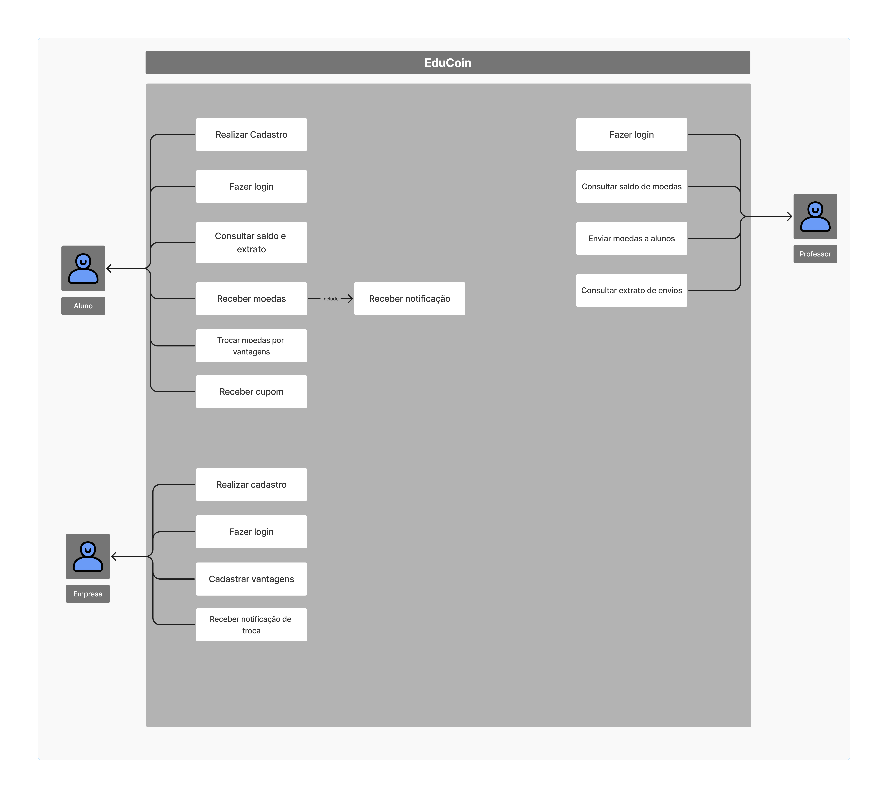
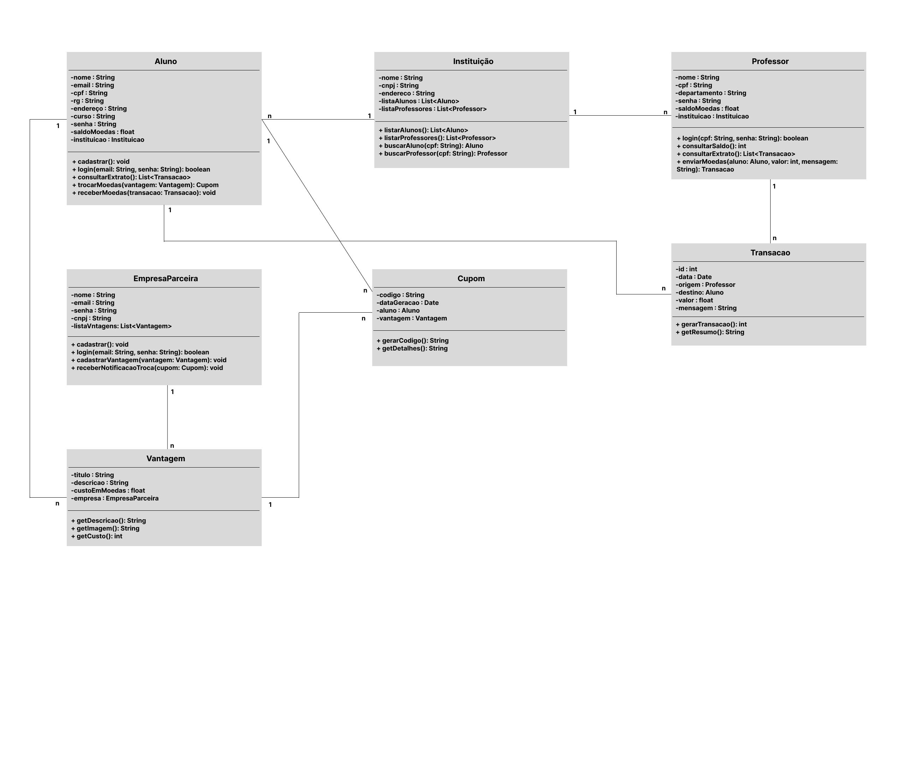
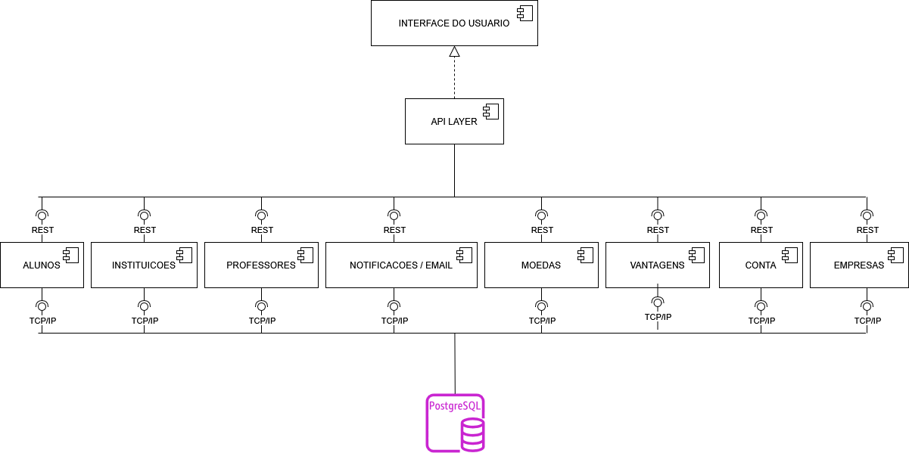

#  EduCoin 📚

Sistema de reconhecimento acadêmico por meio da distribuição de moedas virtuais, que podem ser trocadas por benefícios e recompensas. Alunos, professores e empresas parceiras interagem por meio de uma plataforma que promove o bom desempenho e o engajamento.

---

##  Funcionalidades

###  Alunos
- Cadastro com nome, email, CPF, RG, endereço, instituição de ensino e curso.
- Seleção de instituições pré-cadastradas no sistema.
- Notificação por email ao receber moedas.
- Consulta de extrato de moedas (saldo e histórico de transações).
- Troca de moedas por vantagens (ex: descontos em restaurantes, mensalidade, compra de materiais).
- Recebimento de email com cupom e código de verificação ao resgatar vantagem.

###  Professores
- Pré-cadastrados pela instituição (com nome, CPF e departamento).
- Associados diretamente à instituição de ensino.
- Recebem 1.000 moedas por semestre para distribuir entre os alunos.
- Saldo acumulativo a cada semestre.
- Envio de moedas a alunos com mensagem obrigatória de reconhecimento.
- Consulta de extrato: saldo e histórico de envios.

###  Empresas Parceiras
- Cadastro com nome, email, senha, e lista de vantagens ofertadas.
- Cadastro de vantagens com descrição, foto e custo em moedas.
- Recebimento de email com código de conferência sempre que um aluno resgatar uma vantagem.

---

##  Autenticação

- Todos os usuários (alunos, professores e empresas) devem possuir login e senha.
- A autenticação é obrigatória para acessar as funcionalidades do sistema.

---

##  Notificações por Email

- Aluno recebe email ao ganhar moedas.
- Aluno recebe email com cupom e código ao resgatar uma vantagem.
- Empresa recebe email de notificação da troca com o mesmo código de conferência.

---

##  Exemplo de Vantagens

- Desconto em restaurantes universitários 🍽️
- Desconto na mensalidade 💰
- Compra de materiais específicos 📚
- Benefícios oferecidos por empresas parceiras 🏢

---

## Histórias de usuário 

| Nº | Tipo de Usuário     | História de Usuário                                                                                   |
|----|----------------------|--------------------------------------------------------------------------------------------------------|
| 1  | Aluno                | Como **aluno**, quero **me cadastrar informando meus dados pessoais e acadêmicos**, para que eu possa **participar do sistema EduCoin**. |
| 2  | Aluno                | Como **aluno**, quero **receber moedas de professores como forma de reconhecimento**, para que eu possa **me sentir valorizado e acompanhar meu desempenho**. |
| 3  | Aluno                | Como **aluno**, quero **ver meu saldo e o histórico das moedas recebidas**, para que eu possa **acompanhar minhas conquistas e planejar trocas futuras**. |
| 4  | Aluno                | Como **aluno**, quero **trocar minhas moedas por vantagens oferecidas no sistema**, para que eu possa **utilizar os benefícios como recompensa pelo meu esforço**. |
| 5  | Aluno                | Como **aluno**, quero **receber um email com o cupom e código ao resgatar uma vantagem**, para que eu possa **utilizá-lo de forma segura**. |
| 6  | Professor            | Como **professor**, quero **consultar meu saldo de moedas e o histórico de envios**, para que eu possa **acompanhar como estou distribuindo reconhecimentos**. |
| 7  | Professor            | Como **professor**, quero **enviar moedas para alunos junto de uma mensagem personalizada**, para que eu possa **reconhecer boas atitudes de forma motivadora**. |
| 8  | Professor            | Como **professor**, quero **acumular moedas de um semestre para outro**, para que eu possa **ter mais flexibilidade na distribuição**. |
| 9  | Empresa Parceira     | Como **empresa parceira**, quero **me cadastrar e oferecer vantagens com descrição, imagem e custo**, para que eu possa **atrair alunos e contribuir com o sistema**. |
| 10 | Empresa Parceira     | Como **empresa parceira**, quero **receber um email com os detalhes e código de troca**, para que eu possa **validar o resgate da vantagem com segurança**. |

---

## Diagrama de caso de uso

## Diagrama de classes

## Diagrama de Componentes

##  Requisitos Técnicos 

- Backend: Java / JavaScript / SpringBoot
- Banco de dados: PostgreSQL 
- Frontend: HTML + CSS / Bootstrap
- Autenticação: JWT 
- Integração de Email: 

---

##  Colaboradores

- Lucas Maia Rocha – Desenvolvedor responsável  
- Davi Érico dos Santos – Desenvolvedor responsável  

---

